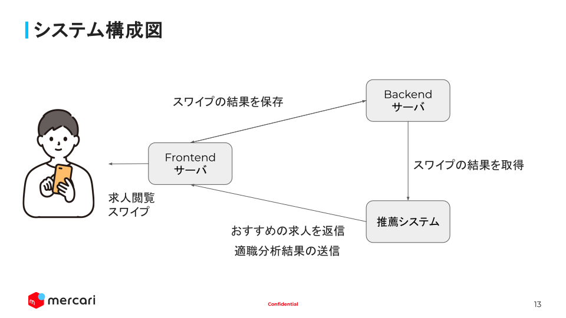
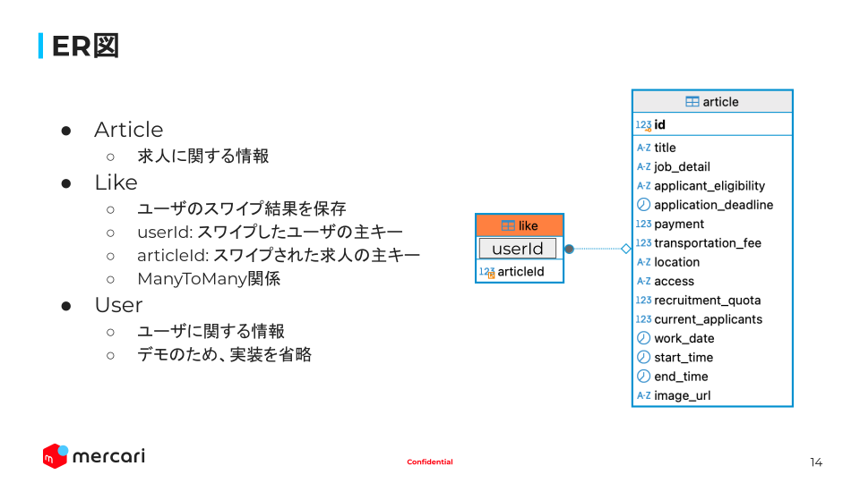

# プロジェクト名

## 概要

Mercari Challenger Hackathon 2024 の参加作品です。

## 起動方法

```bash
$ docker compose up
```

### 動作確認

- フロントエンド: http://localhost:3000
- バックエンド: http://localhost:3001

### API 仕様書

http://localhost:3001/docs

## ディレクトリ構成

- `/backend`: バックエンドのコード
- `/frontend`: フロントエンドのコード
- `/database`: データベースの設定ファイル

## システム構成図



## ER 図


